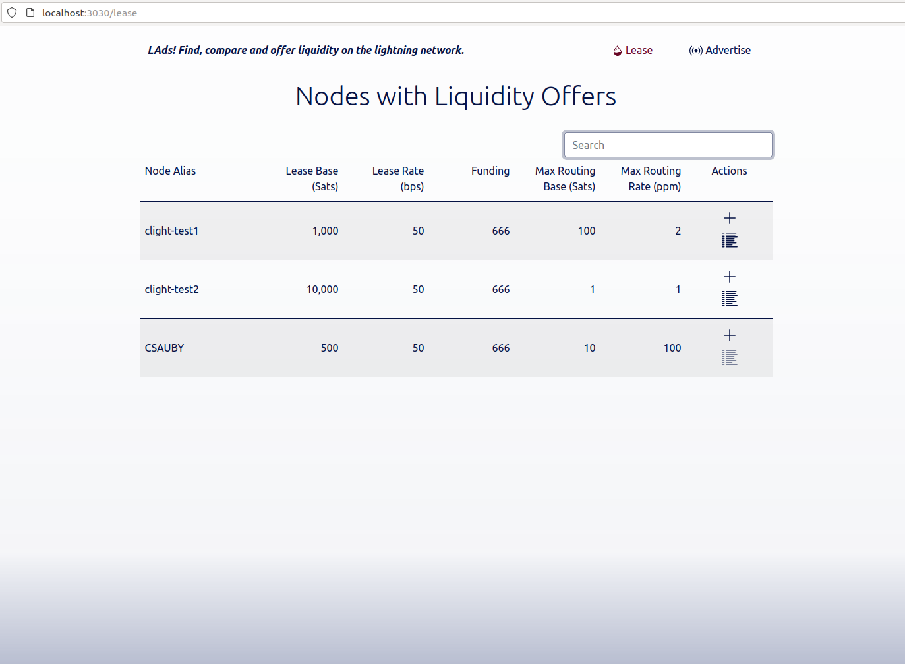
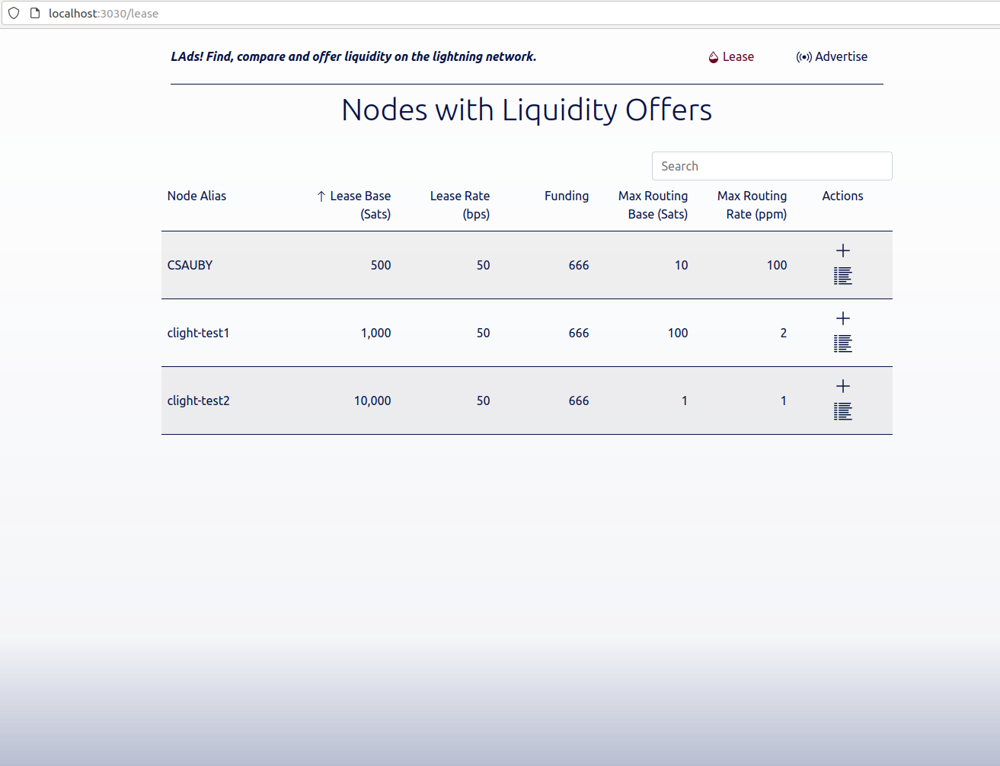
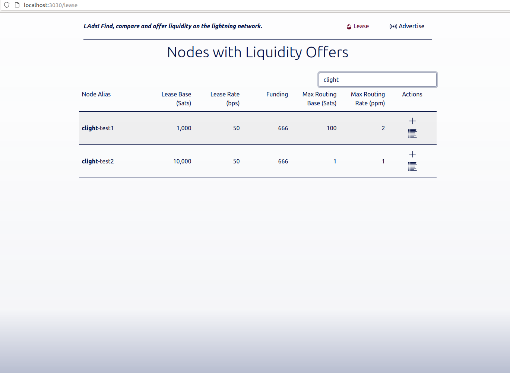
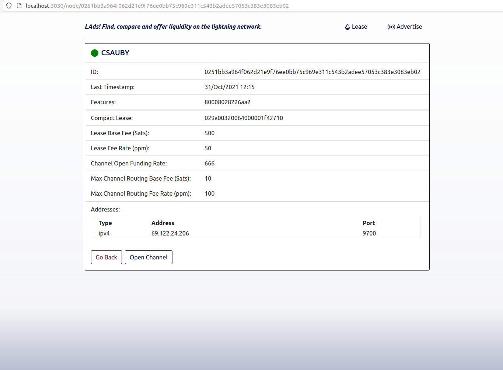
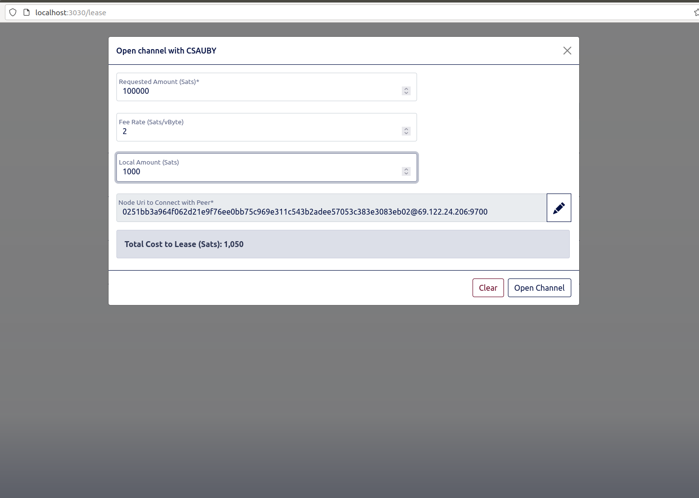
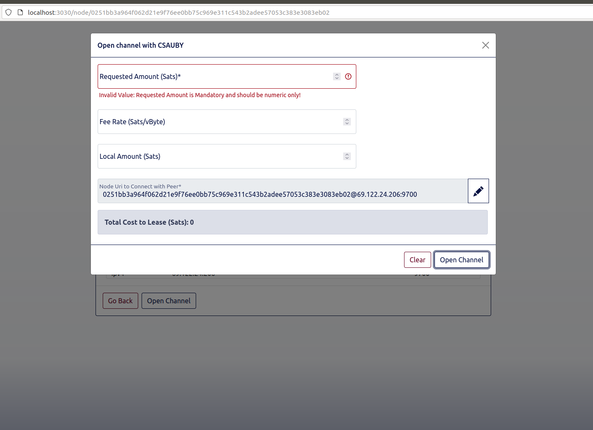
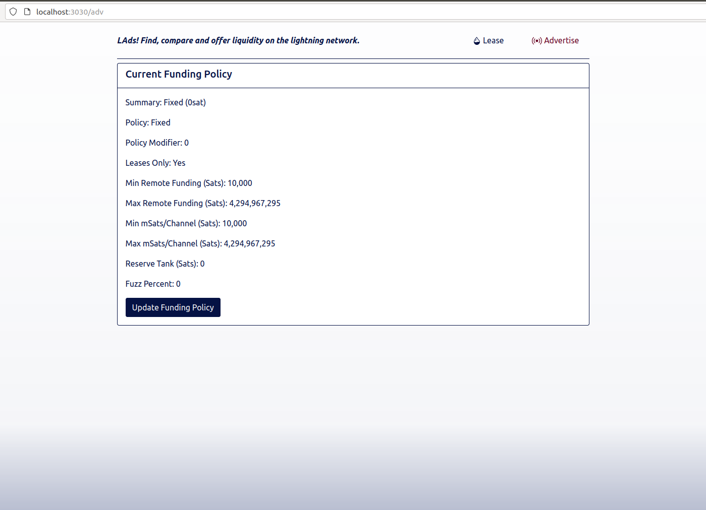
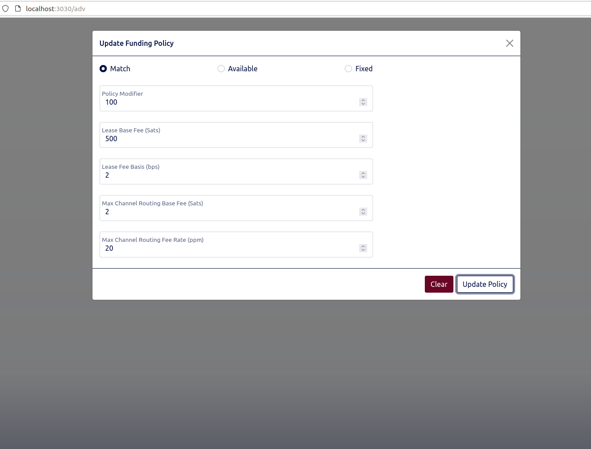
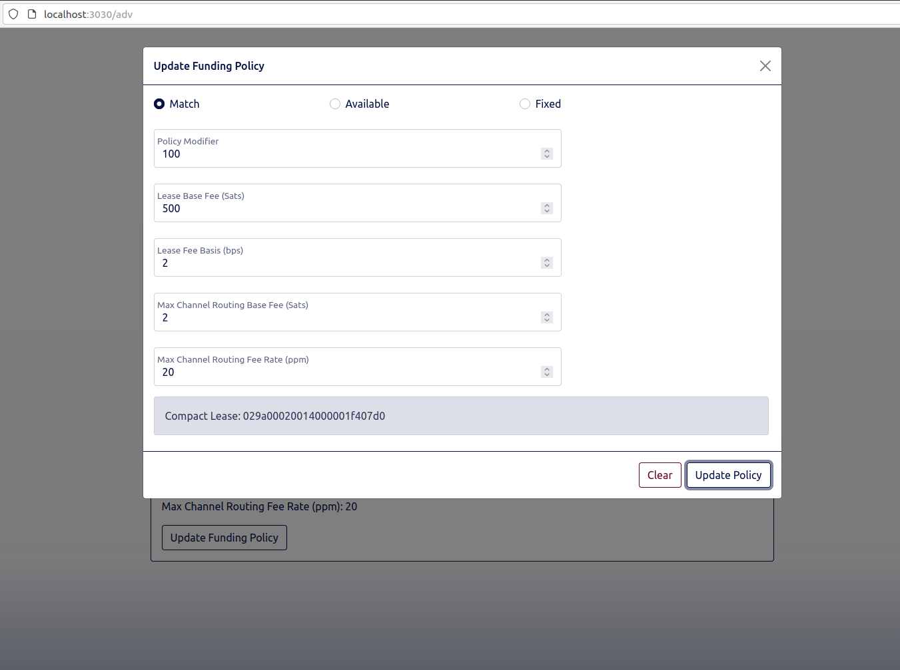

# Liquidity Ads
This product provides an interface to view, manage and accept liquidity ads available via C-Lightning.

## How to run
1) Clone/pull the repository to your local machine.
2) Go into the cloned local folder and run `npm install --prod`.
3) Execute command `node lads` in the same folder once the step two is complete.
4) The server is designed to read the default lightning rpc path. However it can be updated by passing `LN_PATH`'s value to the node environment. For example, replace step 3's command as `LN_PATH=/your/ln/path node lads`.
5) Open the UI in any browser on port 3030 (http://localhost:3030).

## Prerequisites
These instructions are based on assumption that you already are running:
  1) bitcoind
  2) clightning
  3) Nodejs >= v14 & npm >= v7

## Screenshots
### Ads
Ads for the nodes offering liquidity on the network

### Ads Sort
The Ads can be sorted by any of the available columns

### Ads Filter
Search filter can be applied to search on any text on the grid

### Node Details
Details of the node offering liquidity

### Leasing Liquidity
Requesting channel liquidity from the ad

### Open Channel Validation
Open channel form showing error on the incorrect value

### View Funding Policy
View your node's funding policy

### Funding Update
Update your node's funding policy

### Funding Updated
Updated node's funding policy (Returns `Compact Lease` parameter)

